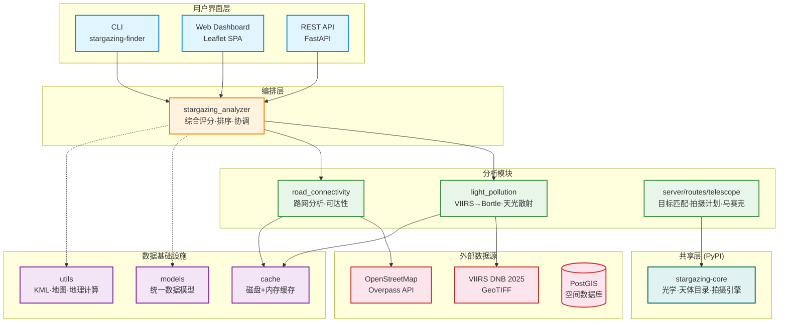
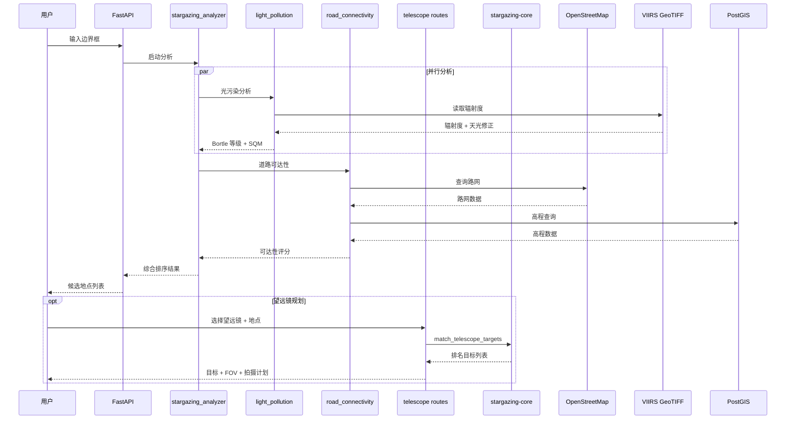

# Stargazing Place Finder

[English](README_EN.md) | 中文

## 项目简介

专为中国观星爱好者设计，基于光污染数据、地理信息、道路可达性和望远镜光学参数，智能推荐最适合观星的地点，并生成针对特定设备的深空天体拍摄计划。

## 功能特点

### 🌌 地点发现与分析
- **智能地点推荐**: 基于 VIIRS 光污染数据 + PostGIS 高程 + OSM 路网，多维度综合评分
- **光污染分析**: VIIRS DNB 辐射度 → 天光散射修正 → Bortle 等级 + SQM 值
- **道路连通性**: PostGIS `planet_osm_line` 路网图 + OSMnx 回退，计算可达性评分
- **海拔筛选**: 优先推荐高海拔、视野开阔的地点
- **避开网红点**: 智能过滤热门景点，寻找安静观星场所（规划中）

### 🔭 望远镜与拍摄规划
- **设备预设**: 内置 Seestar S50、RedCat 51、Askar FRA300 等常见望远镜参数
- **目标匹配**: 根据焦距/口径/传感器/滤镜，推荐最适合拍摄的 Messier/NGC 深空天体
- **FOV 可视化**: 天区覆盖图、目标在焦平面上的填充比例、FOV 旋转
- **拍摄计划**: 单晚逐分钟观测序列，含中天翻转警告 + 月相分离 + 窄带推荐
- **马赛克拼接**: 大目标多面板拼接规划，可调重叠率（5–40%），导出面板坐标

### 🌙 星图与日月信息
- **交互式天图**: Aladin Lite 嵌入，实时显示目标 RA/Dec + FOV 框
- **高度曲线**: 目标整夜高度变化 + 适合度评分曲线
- **月相叠加**: 地图上实时显示日月位置，月相影响评估
- **地点 ↔ 目标联动**: 地图点击地点自动跳转可见目标，目标列表跳转天图

### 🗺️ 地图与可视化
- **光污染瓦片**: Leaflet 多层叠加（Bortle / SQM / 辐射度）
- **候选地点标记**: 聚类展示 + 详情弹出窗
- **海拔热力图**: 区域高程分布
- **面板联动**: 搜索结果 ↔ 天图 ↔ 目标列表统一管理

## 快速开始

### 安装依赖

```bash
uv sync
```

### 启动 Web 服务

```bash
uv run uvicorn server.main:app --host 0.0.0.0 --port 5001 --reload
```

启动后访问：

| 地址 | 说明 |
|------|------|
| `http://localhost:5001/` | Web UI（Leaflet SPA） |
| `http://localhost:5001/api/health` | 健康检查 |
| `http://localhost:5001/docs` | Swagger API 文档 |

### Docker 部署

配合 `mcp-stargazing` Docker 镜像使用，SPF Web 与 MCP Server 在同一容器中通过 supervisord 管理：

```bash
docker run -p 3001:3001 -p 5001:5001 mcp-stargazing
```

## API 端点

### 地点分析

| 端点 | 方法 | 说明 |
|------|------|------|
| `/api/health` | GET | 服务健康检查 |
| `/api/light_pollution` | GET | 视窗光污染数据（Bortle / SQM / 辐射度） |
| `/api/light_pollution/tiles/{z}/{x}/{y}.png` | GET | 光污染栅格瓦片 |
| `/api/coordinate_analysis` | GET | 单点坐标综合分析 |
| `/api/analyze_stargazing_area` | GET/POST | 区域观星地点搜索（分页 + 排序） |

### 望远镜

| 端点 | 方法 | 说明 |
|------|------|------|
| `/api/telescope/presets` | GET | 望远镜设备预设列表 |
| `/api/telescope/optics` | POST | 计算光学参数（FOV、放大倍率、极限星等） |
| `/api/telescope/targets` | POST | 匹配深空天体目标（排名 + FOV 适配 + 月相） |
| `/api/telescope/plan` | POST | 生成单晚拍摄计划（时间序列 + 中天翻转 + 窄带推荐） |
| `/api/telescope/mosaic` | POST | 马赛克拼接规划（多面板 + 可调重叠率） |

## 技术架构

### 架构总览



### 数据流



## 核心数据模型

### 统一 Location 模型

```python
class Location(BaseModel):
    name: str                    # 地点名称
    lat: float                   # 纬度
    lon: float                   # 经度
    elevation_m: float | None    # 海拔（米）
    bortle_class: int | None     # Bortle 等级（1–9）
    road_distance_km: float | None  # 道路距离
    score: float | None          # 综合评分（0–100）
    location_type: str           # 地点类型标签
```

### 望远镜模型（来自 stargazing-core）

```python
class TelescopeConfig(BaseModel):
    focal_length_mm: float
    aperture_mm: float | None
    sensor_width_mm: float | None
    sensor_height_mm: float | None
    sensor_pixel_size_um: float | None
    central_obstruction_pct: float
    reducer_factor: float
    barlow_factor: float
    mount_type: str               # "equatorial" | "altaz"
    filter_type: str | None       # "Hα" | "OIII" | "SII" | None

class ShootingPlan(BaseModel):
    slots: list[ShootingSlot]     # 时间排序的拍摄时段
    moon_warnings: list[str]      # 月相影响警告
    total_exposure_min: float     # 总曝光时间
```

## 技术栈

| 层 | 技术 |
|----|------|
| **Web 框架** | FastAPI + Uvicorn |
| **前端** | Leaflet.js + Aladin Lite + 原生 JS（3142 行 `app.js`） |
| **光污染** | rasterio 解析 VIIRS DNB GeoTIFF + 天光散射模型 |
| **路网** | OSMnx + NetworkX + PostGIS `planet_osm_line` |
| **数据库** | PostGIS（高程 + 空间查询） |
| **共享库** | stargazing-core ≥ 0.1.0（PyPI） |
| **包管理** | uv |

## 依赖关系

```
stargazing-place-finder
└── stargazing-core>=0.1.0  ← PyPI registry
    ├── TelescopeConfig, TelescopeOptics, TELESCOPE_PRESETS
    ├── match_telescope_targets, score_deep_sky_objects
    ├── generate_shooting_schedule, ShootingPlan
    ├── compute_mosaic_grid (MosaicGrid, MosaicPanel)
    └── CelestialPosition, MoonInfo, RiseSet, GeoPoint, ...
```

本地开发时如需使用未发布的 core 版本：

```toml
# pyproject.toml（不要提交此配置）
[tool.uv.sources]
stargazing-core = { path = "../stargazing-core" }
```

## 评分算法

综合评分（0–100 分）由四个维度加权计算：

| 维度 | 权重 | 说明 |
|------|------|------|
| 光污染 | 0–35 | Bortle 等级越低分越高 |
| 城镇隔离 | 0–20 | 远离光污染源加分 |
| 道路可达 | 0–20 | 路网连通性 + 距离 |
| 海拔突出 | 0–15 | 相对周边高程差 |
| 地点类型 | 0–10 | 山峰 > 天文台 > 观景台 |

## 数据库配置

PostGIS 用于高程数据和空间查询，支持 JSON / TOML 两种配置格式。

```bash
export STARGAZING_DB_CONFIG="/path/to/config/db_config.json"
```

**JSON 格式**：
```json
{
    "host": "192.168.1.8",
    "port": 5455,
    "database": "osm_db",
    "user": "postgres",
    "password": "postgres123"
}
```

无 PostGIS 时，系统自动回退到 Overpass API + Open-Elevation API。

## 缓存架构

由 `src/cache/` 统一管理，所有缓存存储在项目根目录 `cache/` 下：

```
cache/
├── images/           # 地图图像缓存
├── road_networks/    # 道路网络数据
├── osmnx/           # OSMnx 地图缓存
├── light_pollution/  # 光污染数据缓存
└── temp/            # 临时文件
```

特点：MD5 缓存键、磁盘持久化、自动恢复、按类型清理。

## 项目状态

✅ **已完成的重大更新**：

| 版本 | 内容 |
|------|------|
| 0.8.0 | stargazing-core 迁移至 PyPI；FastAPI 迁移完成 |
| Phase 4 | 拍摄计划 + 马赛克拼接 + 高度曲线优化 |
| Phase 3 | 地点↔目标联动 + 月相叠加 + 面板统一 |
| Phase 1 | 望远镜天图 + FOV 旋转 + 地图 UI 刷新 |
| 0.7.0 | FastAPI 迁移（Flask → FastAPI）、测试整合 |

🔄 **计划中**：
- 天气数据集成（实时预报 + 观测窗口评分）
- 科学评分系统（用户自定义权重）
- 国际暗夜保护区数据
- 移动端适配

## 贡献指南

欢迎参与贡献！请确保代码符合项目规范，提交前通过测试。

## 许可证

MIT License

---

*让我们一起探索星空，寻找最美的观星地点！* ✨
