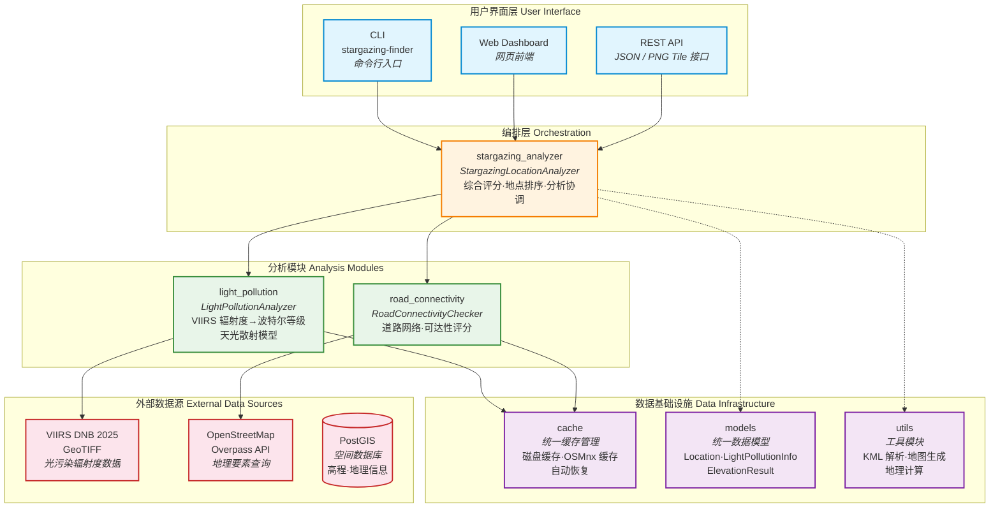
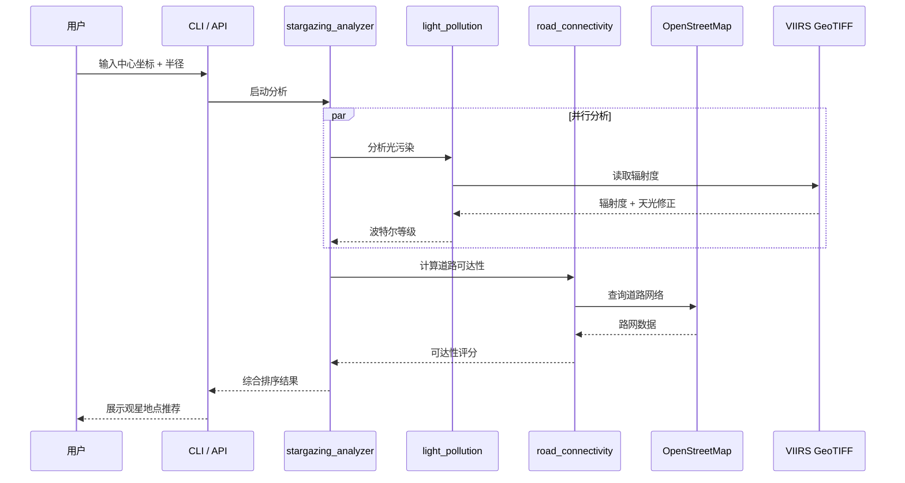

# Stargazing Place Finder

[English](README_EN.md) | 中文

## 项目简介

这是一个专为中国观星爱好者设计的应用程序，旨在帮助用户找到适合观星的地点，同时避开一些网红打卡地，为用户提供更加纯净的观星体验。

## 功能特点

- 🌌 **智能地点推荐**: 基于光污染数据和地理信息，推荐最适合观星的地点
- 🗺️ **避开热门景点**: 智能过滤网红地点，寻找更加安静的观星场所
- 📊 **数据可视化**: 使用热力图展示周边区域的光污染情况
- 🏔️ **海拔筛选**: 优先推荐海拔较高、视野开阔的地点
- 🌃 **光污染分析**: 为所有地点（山峰、天文台、观景台）提供详细的光污染等级信息
- 📈 **智能排序**: 根据光污染程度自动排序，优先显示观星条件更好的地点
- 🚗 **道路连通性检测**: 分析地点的道路可达性，确保推荐地点交通便利

## 快速开始

### 安装依赖

请在项目根目录执行:

```bash
uv sync
```

### 启动 Web UI

当前仓库已内置可运行的静态前端和 Flask API，推荐直接使用根目录启动脚本:

```bash
bash start.sh
```

启动成功后默认可访问:

- Web UI: [http://localhost:8000/src/source/template.html](http://localhost:8000/src/source/template.html)
- API 健康检查: [http://localhost:5001/api/health](http://localhost:5001/api/health)

如果需要把前端连接到其他 API 地址，可在页面 URL 中追加查询参数:

```text
http://localhost:8000/src/source/template.html?apiBaseUrl=http://127.0.0.1:5001
```

前端 API 基地址解析优先级如下:

1. URL 查询参数 `apiBaseUrl`
2. 全局配置 `window.APP_CONFIG.apiBaseUrl`
3. 当前页面主机名自动推导到 `:5001`
4. 本地默认值 `http://127.0.0.1:5001`

### 启动 API

如果只需要启动后端 API，可在项目根目录执行:

```bash
uv run python -m light_pollution.light_pollution_api
```

## Web UI 与 API

### 前端资源位置

当前 Web 前端不是独立前端工程，而是随仓库提供的一套静态资源，位于:

- `src/source/template.html`
- `src/source/assets/js/app.js`
- `src/source/assets/css/styles.css`

### 主要 API 端点

当前前端主要依赖以下后端接口:

- `GET /api/health`: 健康检查
- `GET /api/light_pollution`: 获取视窗范围内的光污染数据
- `GET /api/light_pollution/tiles/{z}/{x}/{y}.png`: 获取光污染瓦片图层
- `GET /api/coordinate_analysis`: 分析单点坐标
- `GET/POST /api/analyze_stargazing_area`: 分析观星区域

### 当前实现状态说明

- Web UI、CLI 和 Python API 都已存在，但使用说明仍在持续收口中。
- `start.sh` 已对齐当前仓库结构，直接服务 `src/source/template.html`，不再依赖历史生成脚本。
- 前端 API 地址现已支持覆盖配置，便于本地联调、反向代理和远程部署场景。

## 技术架构

### 架构总览



### 数据流



### 核心数据模型

**统一Location类**: 项目采用统一的Location数据类来表示所有类型的地理位置，包括山峰、天文台和观景台。这种设计提供了：
- 🔄 **向后兼容性**: 保持Peak、Observatory、Viewpoint别名，确保现有代码正常运行
- 🎯 **类型安全**: 通过location_type字段和类型检查方法确保数据一致性
- 🚀 **扩展性**: 轻松添加新的地点类型而无需修改核心架构

### 数据源

1. **中国地图数据**: 提供基础的地理信息和行政区划
2. **VIIRS DNB 2025 卫星数据**: 使用 NASA / NOAA VIIRS 卫星年度复合辐射度数据（GeoTIFF 格式），提供精确的光污染信息

### 核心算法流程

#### 1. 地点筛选
- 使用暗夜地图检测地点的光污染程度
- 筛选出黑暗度符合观星要求的区域

#### 2. 地图可视化
1. **海拔筛选**: 搜索海拔高于周边地区100米以上的地点（搜索半径10公里）
2. **暗度检测**: 从暗夜地图中获取该地点的光污染数值，**含天光散射模型修正**
3. **周边分析**: 分析周边区域的光污染情况，构建热力图
4. **地图展示**: 使用OpenStreetMap进行可视化展示

## 技术栈

- **地图服务**: OpenStreetMap
- **数据源**: VIIRS DNB 2025 卫星光污染数据 (GeoTIFF)
- **可视化**: 热力图展示、聚类地图、标记点地图
- **地理数据**: 中国地图数据
- **缓存管理**: 统一的缓存配置系统（`src/cache/`）
- **数据模型**: 统一Location类架构，支持山峰、天文台、观景台等多种地点类型
- **光污染分析**: 集成LightPollutionAnalyzer，为所有地点提供实时光污染等级评估
- **道路连通性**: 集成RoadConnectivityChecker，分析地点的道路可达性
- **GeoTIFF解析**: 使用 rasterio 直接读取 VIIRS 辐射度数据，支持波特尔等级转换

## 数据库配置

PostGIS 数据库用于存储高程数据和地理位置信息，需要配置数据库连接才能使用相关功能。

### 配置文件格式

支持 JSON 和 TOML 两种格式：

**JSON 格式** (`config/db_config.json`):
```json
{
    "host": "192.168.1.8",
    "port": 5455,
    "database": "osm_db",
    "user": "postgres",
    "password": "postgres123"
}
```

**TOML 格式** (`config/postgis_config.toml`):
```toml
host = "192.168.1.8"
port = 5455
database = "osm_db"
user = "postgres"
password = "postgres123"
```

### 环境变量配置

Web 服务支持以下环境变量配置：

- `STARGAZING_DB_CONFIG`: 指定 PostGIS 数据库配置文件的路径，用于加载自定义的数据库连接信息。

示例：
```bash
export STARGAZING_DB_CONFIG="/path/to/config/db_config.json"
```

## 缓存配置

项目采用统一的缓存管理系统，由 `src/cache/` 模块管理，所有缓存文件存储在项目根目录的 `cache/` 文件夹中：

```
cache/
├── images/          # 图像文件缓存
├── road_networks/   # 道路网络数据缓存
├── osmnx/          # OSMnx地图数据缓存
├── light_pollution/ # 光污染数据缓存
└── temp/           # 临时文件缓存
```

### 缓存功能特点

- 🗂️ **统一管理**: 所有缓存文件集中存储，便于管理和清理
- 🚀 **性能优化**: 智能缓存机制，避免重复下载和计算
- 💾 **磁盘缓存**: 图像和地图数据持久化存储，提升启动速度
- 🧹 **灵活清理**: 支持按类型清理缓存，释放存储空间
- 🔄 **自动恢复**: 缓存丢失时自动重新生成数据

### 缓存使用示例

```bash
# 运行缓存配置演示
python examples/cache_example.py
```

该演示脚本将展示：
- 缓存目录结构和大小统计
- OSMnx缓存配置
- 临时文件创建和管理
- 缓存清理功能
- 光污染数据缓存管理

## 法律声明

⚠️ **重要提醒**: 本应用在使用海拔数据进行地点筛选时，严格遵守中国相关法律法规。请用户在使用过程中注意相关法律要求。

## 使用场景

- 天文摄影爱好者寻找拍摄地点
- 观星活动组织者选择活动场地
- 天文科普教育活动场地选择
- 个人观星体验优化

## 项目状态

✅ **功能完整** - 项目核心功能已完成开发和测试，包括：
- ✅ 山峰查找和筛选功能
- ✅ 光污染数据分析功能
- ✅ 道路连通性检测功能
- ✅ 综合评分和排序系统
- ✅ 统一Location数据模型（支持山峰、天文台、观景台）
- ✅ 向后兼容的类型别名系统
- ✅ 完整的测试覆盖
- ✅ 详细的使用文档

🔄 **持续优化** - 欢迎贡献代码和建议以进一步改进项目。

## 📋 Todo List

### 🎯 核心特色
- [x] 光污染强制检测：确保观星地点的暗夜质量
- [x] 道路可达性分析：平衡观星质量与交通便利性
- [x] 统一Location数据模型：支持多种地点类型的统一管理

### 🚀 功能增强
- [ ] **避开网红点**: 智能筛选远离热门景点和人群聚集地的安静观星地点
- [ ] 科学评分系统：基于多维度数据的智能评分算法
- [ ] 添加天气数据集成，提供实时天气预报
- [ ] 支持用户自定义评分权重
- [ ] 增加月相信息和最佳观测时间推荐
- [ ] 开发移动端应用
- [ ] 添加用户评价和分享功能
- [ ] 优化聚类地图算法，提高地点推荐准确性

### 🌐 数据扩展
- [ ] 本地数据库支持
- [ ] 支持更多光污染数据源
- [ ] 集成卫星云图数据
- [ ] 添加国际暗夜保护区数据
- [ ] 支持全球范围的地点分析
- [ ] 整合更多观星地点数据库

## 贡献指南

欢迎对本项目感兴趣的开发者参与贡献！请确保您的代码符合项目的编码规范，并在提交前进行充分测试。

## 许可证

本项目采用开源许可证，具体许可证信息请查看LICENSE文件。

---

*让我们一起探索星空，寻找最美的观星地点！* ✨
